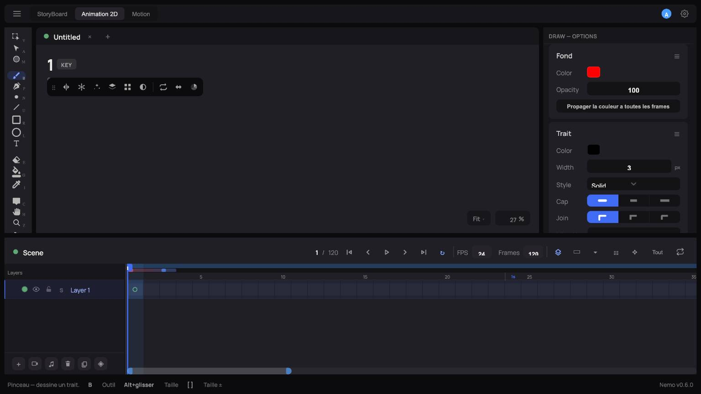

# 2. L'interface

Nemo affiche **trois vues d'un même document**, pas trois éditeurs séparés. En haut à gauche,
trois onglets permettent de basculer entre elles à tout moment sans perdre de contexte :

| Vue | À quoi elle sert |
|---|---|
| **StoryBoard** | Montage nodal : enchaîner des Components en une séquence, ajouter du son |
| **Animation 2D** | La vue par défaut — dessin frame-by-frame, calques, timeline classique |
| **Motion** | Animer des propriétés (position, rotation, échelle, opacité…) façon After Effects, par keyframes |

Ces trois vues partagent le **même document** : un calque dessiné en Animation 2D peut devenir
un Component animable en Motion, puis être séquencé dans un montage StoryBoard. Voir
[Components et StoryBoard](07-storyboard-composants.md) pour le détail de ce qui déclenche le
passage de l'un à l'autre.

## Zones de l'écran (vue Animation 2D)

- **Barre du haut** — menu, sélecteur de vue (StoryBoard/Animation 2D/Motion), onglets de
  projets ouverts, réglages.
- **Barre d'outils gauche** — outils de sélection et de dessin (voir
  [Dessiner](03-dessin.md)).
- **Canevas central** — la zone de dessin, avec le numéro de frame et son statut (`KEY` =
  keyframe) affichés en haut à gauche.
- **Panneau droit "Draw — Options"** — réglages de l'outil actif : couleur/opacité du fond, du
  trait (épaisseur, style, cap, jointure), et selon l'outil, des options avancées (brush texturé,
  mode Shadow, etc.).
- **Bande "Scene" en bas** — la timeline : calques à gauche, frames/keyframes à droite, avec les
  contrôles de lecture, l'onion skin et le FPS.

## Barre d'outils flottante du canevas

Une petite barre flottante apparaît en haut du canevas (visible sur la capture ci-dessus) avec
des raccourcis vers : alignement, grille, snapping, effets de calque, retournement, et menu
radial d'outils.

## Panneaux détachables

Les panneaux (comme "Draw — Options") peuvent être détachés en glissant leur en-tête — ils
deviennent flottants et restent contraints à l'intérieur de la fenêtre (impossible de les
perdre hors écran).

## Onglets de projet

Chaque projet ouvert a son propre onglet en haut du canevas (visible : `Untitled ✕ +`). Le bouton
**+** (ou **Nouveau projet — nouvel onglet** dans la barre du haut) ouvre un nouveau projet vierge
sans fermer celui en cours.
