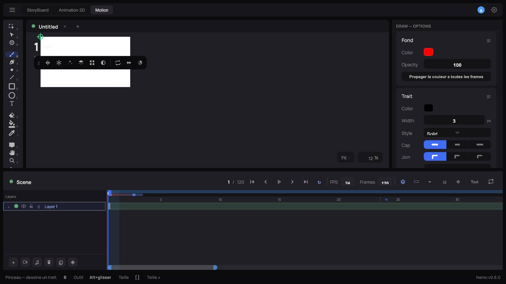

# 6. Mode Motion

Le mode **Motion** (onglet en haut) anime des **propriétés** par keyframes, façon After Effects —
complémentaire du dessin frame-by-frame de la vue Animation 2D.

## Quand un calque bascule en Motion

Un calque plat et sa vue Motion sont **la même chose** tant qu'aucune de ses propriétés n'a de
clé. Dès que vous posez la première clé sur une propriété de niveau **calque** — Position,
Ancrage, Rotation, Échelle, Opacité — que ce soit via le chronomètre du panneau ou en glissant
directement l'élément sur le canevas, le calque (s'il contient 2 éléments ou plus) devient
automatiquement un **Component**. Une clé posée sur un seul élément à l'intérieur du calque (pas
le calque entier) ne déclenche pas cette conversion.

## Propriétés animables

Les 5 propriétés de base d'un calque/Component : **Position**, **Ancrage**, **Rotation**,
**Échelle**, **Opacité**. Chacune peut recevoir des keyframes indépendantes sur sa propre piste
dans la timeline Motion.

## Entrer dans un calque (precomp)

Double-cliquer un calque en Motion permet d'"entrer dedans" comme un precomp After Effects : les
propriétés globales du calque restent visibles au-dessus, et des sous-lignes apparaissent
en-dessous — une par élément du calque — chacune avec son propre jeu de propriétés. Un bouton
retour à côté de la scène permet de ressortir vers le Component parent.

> ❌ **Pas encore disponible** : à la date de rédaction, seules les 5 propriétés de base sont
> exposées par élément — pas encore le path/fill/stroke/brush par sous-élément décrits comme
> prochaine étape. Vérifier l'état actuel avant de documenter cette partie plus en détail.

## Propriétés étendues

Certaines propriétés (fill, stroke, brush) ne sont pas affichées par défaut dans la liste Motion —
elles s'activent explicitement dans le panneau de droite, sur le même principe que les
propriétés additionnelles optionnelles de Rive : pas de bruit visuel tant qu'on n'en a pas besoin.

## Instances de Component

Une instance de Component garde sa propre mini-timeline (vitesse et mode de lecture réglables
par instance) — plusieurs instances du même Component peuvent jouer leur animation à des
vitesses ou décalages différents sans dupliquer le dessin source.

## Caméra par Component

Si vous ajoutez un calque caméra à l'intérieur d'un Component, sa timeline caméra est propre à
ce Component : le mouvement de caméra voyage avec l'instance partout où elle est utilisée
(Animation 2D, export, StoryBoard).
